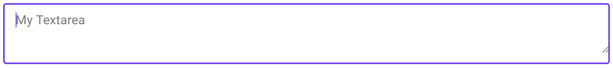

# `<mwc-textarea>` [](https://www.npmjs.com/package/@material/mwc-textarea)

> IMPORTANT: The Material Web Components are a work in progress and subject to
> major changes until 1.0 release.

Text areas let users enter and edit text.


[Material Design Guidelines: text areas](https://material.io/design/components/text-fields.html)

## Installation

```sh
npm install @material/mwc-textarea
```

> NOTE: The Material Web Components are distributed as ES2017 JavaScript
> Modules, and use the Custom Elements API. They are compatible with all modern
> browsers including Chrome, Firefox, Safari, Edge, and IE11, but an additional
> tooling step is required to resolve *bare module specifiers*, as well as
> transpilation and polyfills for Edge and IE11. See
> [here](https://github.com/material-components/material-components-web-components#quick-start)
> for detailed instructions.

## Example usage

### Standard


```html
<mwc-textarea label="My Textarea"></mwc-textarea>

<script type="module">
  import '@material/mwc-textarea';
</script>
```

### Helper Text


```html
<mwc-textarea label="My Textarea" helper="Helper Text"></mwc-textarea>
```

### Primary Color


```html
<style>
  mwc-textarea {
    --mdc-theme-primary: green;
  }
</style>

<mwc-textarea
    label="My Textarea"
    required>
</mwc-textarea>
```

## Variants


### Outlined


```html
<mwc-textarea
    outlined
    label="My Textarea">
</mwc-textarea>
```

#### Shaping Outlined


```html
<style>
  mwc-textarea.left {
    --mdc-notched-outline-leading-width: 28px;
    --mdc-notched-outline-leading-border-radius: 28px 0 0 28px;
  }

  mwc-textarea.right {
    --mdc-notched-outline-trailing-border-radius: 0 28px 28px 0;
  }
</style>

<mwc-textarea
    class="left";
    label="My Textarea"
    outlined>
</mwc-textarea>

<mwc-textarea
    class="right";
    label="My Textarea"
    outlined>
</mwc-textarea>

<mwc-textarea
    class="left right";
    label="My Textarea"
    outlined>
</mwc-textarea>
```

### Fullwidth



```html
<!-- Note: Fullwidth does not support label; only placeholder -->
<mwc-textarea outlined fullwidth placeholder="My Textarea"></mwc-textarea>
```

## API

### Properties/Attributes

| Name                | Type             | Description
| ------------------- | ---------------- |------------
| `rows`              | `number`         | Sets number of visible text lines.
| `cols`              | `number`         | Sets the visible width of the textarea.
| `value`             | `string`         | The input control's value.
| `type`              | `TextFieldType*` | A string specifying the type of control to render.
| `label`             | `string`         | Sets floating label value.
| `placeholder`       | `string`         | Sets disappearing input placeholder.
| `icon`              | `string`         | Leading icon to display in input. See [`mwc-icon`](https://github.com/material-components/material-components-web-components/tree/master/packages/icon).
| `iconTrailing`      | `string`         | Trailing icon to display in input. See [`mwc-icon`](https://github.com/material-components/material-components-web-components/tree/master/packages/icon).
| `disabled`          | `boolean`        | Whether or not the input should be disabled.
| `required`          | `boolean`        | Displays error state if value is empty and input is blurred.
| `maxlength`         | `number`         | Maximum length to accept input.
| `charCounter`       | `boolean`        | **Note: requries `maxlength` to be set.** Display character counter with max length.
| `outlined`          | `boolean`        | Whether or not to show the material outlined variant.
| `fullwidth`         | `boolean`        | Whether or not to make the input fullwidth. No longer displays `label`; only `placeholder` and `helper`.
| `helper`            | `string`         | Helper text to display below the input. Display default only when focused.
| `helperPersistent`  | `boolean`        | Always show the helper text despite focus.

\*  `TextFieldType` is exported by `mwc-textarea` and `mwc-textarea-base`.
```ts
type TextFieldType = 'text'|'search'|'tel'|'url'|'email'|'password'|
    'date'|'month'|'week'|'time'|'datetime-local'|'number'|'color';
```

### CSS Custom Properties

Inherits CSS Custom properties from:
* [`mwc-ripple`](https://github.com/material-components/material-components-web-components/tree/master/packages/ripple)
* [`mwc-notched-outline`](https://github.com/material-components/material-components-web-components/tree/master/packages/notched-outline).
* [`mwc-icon`](https://github.com/material-components/material-components-web-components/tree/master/packages/icon)

| Name                                              | Default               | Description
| ------------------------------------------------- | --------------------- |------------
| `--mdc-theme-primary`                             | `#6200ee`             | Color when active of the underline ripple, the outline, and the caret.
| `--mdc-theme-error`                               | `#b00020`             | Color when errored of the underline, the outline, the caret, and the icons.
| `--mdc-text-area-filled-border-radius`           | `4px 4px 0 0`          | Border radius of the standard / filled textarea's background filling.
| `--mdc-text-area-outlined-idle-border-color`     | `rgba(0, 0, 0, 0.38)`  | Color of the outlined textarea's  outline when idle.
| `--mdc-text-area-outlined-hover-border-color`    | `rgba(0, 0, 0, 0.87)`  | Color of the outlined textarea's outline when hovering.
| `--mdc-text-area-outlined-disabled-border-color` | `rgba(0, 0, 0, 0.06)`  | Color of the outlined textarea's outline when disabled.

## Additional references

- [MDC Web textfields](https://material.io/develop/web/components/input-controls/text-field/)
