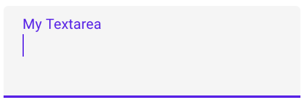
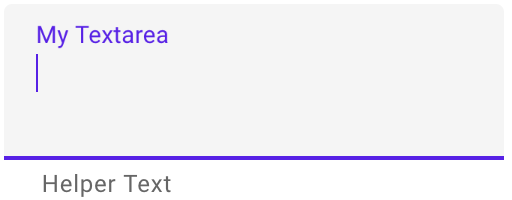
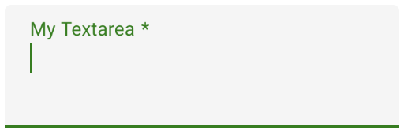
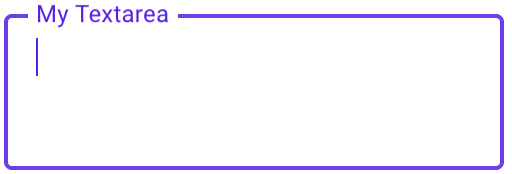
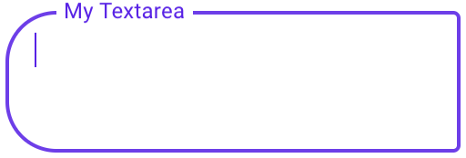
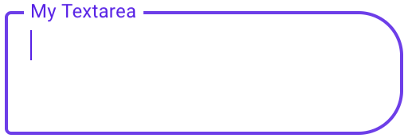
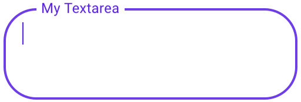

# `<mwc-textarea>` [](https://www.npmjs.com/package/@material/mwc-textarea)

> IMPORTANT: The Material Web Components are a work in progress and subject to
> major changes until 1.0 release.

Text areas let users enter and edit text.



[Material Design Guidelines: text areas](https://material.io/design/components/text-fields.html)

[Demo](https://material-components.github.io/material-components-web-components/demos/textarea/)

## Installation

```sh
npm install @material/mwc-textarea
```

> NOTE: The Material Web Components are distributed as ES2017 JavaScript
> Modules, and use the Custom Elements API. They are compatible with all modern
> browsers including Chrome, Firefox, Safari, Edge, and IE11, but an additional
> tooling step is required to resolve *bare module specifiers*, as well as
> transpilation and polyfills for IE11. See
> [here](https://github.com/material-components/material-components-web-components#quick-start)
> for detailed instructions.

## Example usage

### Standard


```html
<mwc-textarea label="My Textarea"></mwc-textarea>

<script type="module">
  import '@material/mwc-textarea';
</script>
```

### Helper Text



```html
<mwc-textarea label="My Textarea" helper="Helper Text"></mwc-textarea>
```

### Primary Color



```html
<style>
  mwc-textarea {
    --mdc-theme-primary: green;
  }
</style>

<mwc-textarea
    label="My Textarea"
    required>
</mwc-textarea>
```

## Variants


### Outlined



```html
<mwc-textarea
    outlined
    label="My Textarea">
</mwc-textarea>
```

#### Shaping Outlined





```html
<style>
  mwc-textarea.left {
    --mdc-notched-outline-leading-width: 28px;
    --mdc-notched-outline-leading-border-radius: 28px 0 0 28px;
  }

  mwc-textarea.right {
    --mdc-notched-outline-trailing-border-radius: 0 28px 28px 0;
  }
</style>

<mwc-textarea
    class="left";
    label="My Textarea"
    outlined>
</mwc-textarea>

<mwc-textarea
    class="right";
    label="My Textarea"
    outlined>
</mwc-textarea>

<mwc-textarea
    class="left right"
    label="My Textarea"
    outlined>
</mwc-textarea>
```

## API

### Properties/Attributes

| Name                | Type             | Description
| ------------------- | ---------------- |------------
| `rows`              | `number`         | Sets number of visible text lines.
| `cols`              | `number`         | Sets the visible width of the textarea.
| `value`             | `string`         | The input control's value.
| `type`              | `TextFieldType*` | A string specifying the type of control to render.
| `label`             | `string`         | Sets floating label value.
| `placeholder`       | `string`         | Sets disappearing input placeholder.
| `icon`              | `string`         | Leading icon to display in input. See [`mwc-icon`](https://github.com/material-components/material-components-web-components/tree/master/packages/icon).
| `iconTrailing`      | `string`         | Trailing icon to display in input. See [`mwc-icon`](https://github.com/material-components/material-components-web-components/tree/master/packages/icon).
| `disabled`          | `boolean`        | Whether or not the input should be disabled.
| `charCounter`       | `boolean`\|`TextAreaCharCounter**` | **Note: requires `maxLength` to be set.** Display character counter with max length. Textareas may display an `"external"` or `"internal"` `charCounter`. When `true`, textareas display an external character counter by default.
| `outlined`          | `boolean`        | Whether or not to show the material outlined variant.
| `helper`            | `string`         | Helper text to display below the input. Display default only when focused.
| `helperPersistent`  | `boolean`        | Always show the helper text despite focus.
| `required`          | `boolean`        | Displays error state if value is empty and input is blurred.
| `maxLength`         | `number`         | Maximum length input to accept.
| `validationMessage` | `string`         | Message to show in the error color when the textarea is invalid. (Helper text will not be visible)
| `validity`          | `ValidityState` (readonly) | The [`ValidityState`](https://developer.mozilla.org/en-US/docs/Web/API/ValidityState) of the textfield.
| `willValidate`      | `boolean` (readonly)       | [`HTMLInputElement.prototype.willValidate`](https://developer.mozilla.org/en-US/docs/Web/API/HTMLInputElement#Properties)
| `validityTransform` | `ValidityTransform***`\|`null` | Callback called before each validation check. See the [validation section](#Validation) for more details.
| `validateOnInitialRender` | `boolean`            | Runs validation check on initial render.
`name`                | `string`         | Sets the `name` attribute on the internal textarea.\*\*\*

\*  `TextFieldType` is exported by `mwc-textarea` and `mwc-textarea-base`.
```ts
type TextFieldType = 'text'|'search'|'tel'|'url'|'email'|'password'|
    'date'|'month'|'week'|'time'|'datetime-local'|'number'|'color';
```
\*\*  `TextAreaCharCounter` is exported by `mwc-textarea`.
```ts
type TextAreaCharCounter = 'external'|'internal';

\*\*\* `ValidityTransform` is not exported. See the [validation section](#Validation) for more details.
```ts
type ValidityTransform = (value: string, nativeValidity: ValidityState) => Partial<ValidityState>
```

\*\*\* The `name` property should only be used for browser autofill as webcomponent form participation does not currently consider the `name` attribute. See [#289](https://github.com/material-components/material-components-web-components/issues/289).

### Methods

| Name     | Description
| -------- | -------------
| `checkValidity() => boolean`   | Returns `true` if the textarea passes validity checks. Returns `false` and fires an [`invalid`](https://developer.mozilla.org/en-US/docs/Web/API/HTMLInputElement/invalid_event) event on the textarea otherwise.
| `reportValidity() => boolean`   | Runs `checkValidity()` method, and if it returns false, then it reports to the user that the input is invalid.
| `setCustomValidity(message:string) => void`   | Sets a custom validity message (also overwrites `validationMessage`). If this message is not the empty string, then the element is suffering from a  custom validity error and does not validate.
| `layout() => Promise<void>`   | Re-calculate layout. If a textarea is styled with `display:none` before it is first rendered, and it has a label that is floating, then you must call `layout()` the first time you remove `display:none`, or else the notch surrounding the label will not render correctly.

### CSS Custom Properties

Inherits CSS Custom properties from:
* [`mwc-ripple`](https://github.com/material-components/material-components-web-components/tree/master/packages/ripple)
* [`mwc-notched-outline`](https://github.com/material-components/material-components-web-components/tree/master/packages/notched-outline).
* [`mwc-icon`](https://github.com/material-components/material-components-web-components/tree/master/packages/icon)

| Name                                              | Default               | Description
| ------------------------------------------------- | --------------------- |------------
| `--mdc-theme-primary`                             | `#6200ee`             | Color when active of the underline ripple, the outline, and the caret.
| `--mdc-theme-error`                               | `#b00020`             | Color when errored of the underline, the outline, the caret, and the icons.
| `--mdc-text-area-filled-border-radius`           | `4px 4px 0 0`          | Border radius of the standard / filled textarea's background filling.
| `--mdc-text-area-outlined-idle-border-color`     | `rgba(0, 0, 0, 0.38)`  | Color of the outlined textarea's  outline when idle.
| `--mdc-text-area-outlined-hover-border-color`    | `rgba(0, 0, 0, 0.87)`  | Color of the outlined textarea's outline when hovering.
| `--mdc-text-area-outlined-disabled-border-color` | `rgba(0, 0, 0, 0.06)`  | Color of the outlined textarea's outline when disabled.

### Validation

`<mwc-textarea>` follows the basic `<input>` [constraint validation model](https://developer.mozilla.org/en-US/docs/Web/Guide/HTML/HTML5/Constraint_validation).
It exposes:

* `required`
* `maxLength`
* `validity`
* `willValidate`
* `checkValidity()`
* `reportValidity()`
* `setCustomValidity(message)`

Additionally, it implements more features such as:
* `validationMessage`
* `validateOnInitialRender`
* and `validityTransform`

By default, `<mwc-textarea>` will report validation on `blur`.

#### Custom validation logic

The `validityTransform` property is a function that can be set on `<mwc-textarea>` to
implement custom validation logic that transforms the `ValidityState` of the
input control. The type of a `ValidityTransform` is the following:

```ts
(value: string, nativeValidity: ValidityState) => Partial<ValidityState>
```

Where `value` is the new value in the textarea to be validated and
`nativeValidity` is an interface of
[`ValidityState`](https://developer.mozilla.org/en-US/docs/Web/API/ValidityState)
of the native input control. For example:

```html
<mwc-textarea
    id="my-textarea"
    maxlength="5"
    value="doggos">
</mwc-textarea>
<script>
  const textarea = document.querySelector('#my-textarea');
  textarea.validityTransform = (newValue, nativeValidity) => {
    if (!nativeValidity.valid) {
      if (nativeValidity.tooLong) {
        const hasDog = newValue.includes('dog');
        // changes to make to the nativeValidity
        return {
          valid: hasDog,
          tooLong: !hasDog;
        };
      } else {
        // no changes
        return {};
      }
    } else {
      const isValid = someExpensiveOperation(newValue);
      // changes to make to the native validity
      return {
        valid: isValid,
        // or whatever type of ValidityState prop you would like to set (if any)
        customError: !isValid,
      };
    }
  }
</script>
```

In this example we first check the native validity which is invalid due to the
maxlength (the value is `doggos` which is a string longer than 5). The value
includes `dog`, thus we make it valid and undo the `tooLong` error in the
`ValidityState` by returning a `Partial<ValidityState>` that indicates what to
change in the initial validity.

In this example, we also skip an expensive validity check by short-circuiting
the validation by checking the native validation.

*Note:* the UI will only update as valid / invalid by checking the `valid`
property of the transformed `ValidityState`.

## Additional references

- [MDC Web textfields](https://material.io/develop/web/components/input-controls/text-field/)
