# `<mwc-textfield>` & `<mwc-textarea>` [](https://www.npmjs.com/package/@material/mwc-textfield)

> IMPORTANT: The Material Web Components are a work in progress and subject to
> major changes until 1.0 release.

textfields provide brief messages about app processes at the bottom of the
screen.

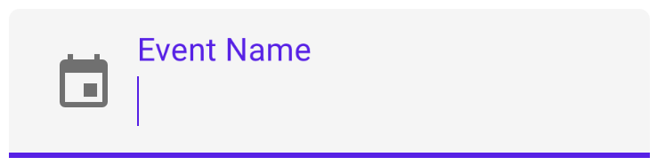

[Material Design Guidelines: textfields](https://material.io/design/components/textfields.html)

## Installation

```sh
npm install @material/mwc-textfield
```

> NOTE: The Material Web Components are distributed as ES2017 JavaScript
> Modules, and use the Custom Elements API. They are compatible with all modern
> browsers including Chrome, Firefox, Safari, Edge, and IE11, but an additional
> tooling step is required to resolve *bare module specifiers*, as well as
> transpilation and polyfills for Edge and IE11. See
> [here](https://github.com/material-components/material-components-web-components#quick-start)
> for detailed instructions.

## Example usage

### Standard / Filled

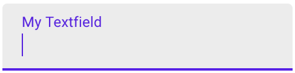

```html
<mwc-textfield label="My Textfield"></mwc-textfield>

<script type="module">
  import '@material/mwc-textfield';
</script>
```

### Icon - Leading

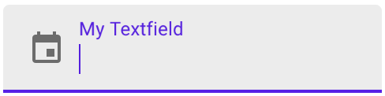

```html
<mwc-textfield label="My Textfield" icon="event"></mwc-textfield>

<script type="module">
  import '@material/mwc-textfield';
  import '@material/mwc-icon/mwc-icon-font.js';
</script>
```

### Icon - Trailing

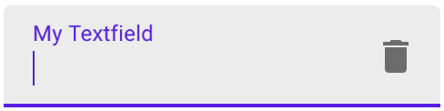

```html
<mwc-textfield label="My Textfield" iconTrailing="delete"></mwc-textfield>

<script type="module">
  import '@material/mwc-textfield';
  import '@material/mwc-icon/mwc-icon-font.js';
</script>
```

### Helper Text

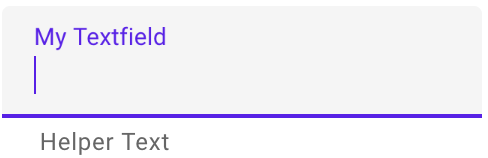

```html
<mwc-textfield label="My Textfield" helper="Helper Text"></mwc-textfield>

<script type="module">
  import '@material/mwc-textfield';
</script>
```

### Primary Color

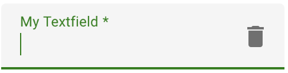

```html
<style>
  mwc-textfield {
    --mdc-theme-primary: green;
  }
</style>

<mwc-textfield
    label="My Textfield"
    iconTrailing="delete"
    required>
</mwc-textfield>

<script type="module">
  import '@material/mwc-textfield';
  import '@material/mwc-icon/mwc-icon-font.js';
</script>
```

### Error Color

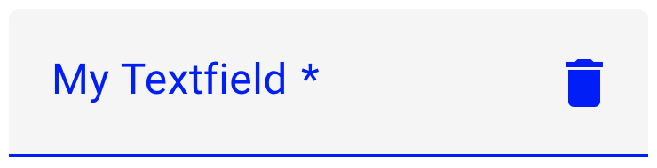

```html
<style>
  mwc-textfield {
    --mdc-theme-error: blue;
  }
</style>

<mwc-textfield
    label="My Textfield"
    iconTrailing="delete"
    required>
</mwc-textfield>

<script type="module">
  import '@material/mwc-textfield';
  import '@material/mwc-icon/mwc-icon-font.js';
</script>
```

## Example usage (mwc-textfield)

## Variants

### Textarea
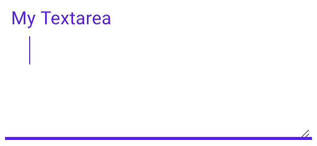

```html
<mwc-textarea label="My Textarea"></mwc-textarea>

<script type="module">
  import '@material/mwc-textfield/mwc-textarea.js';
</script>
```

### Outlined

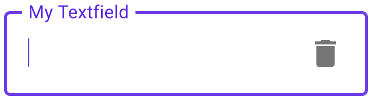
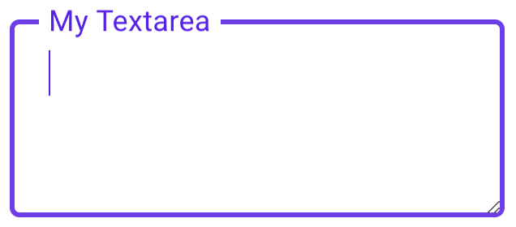

```html
<mwc-textfield
    outlined
    label="My Textfield"
    iconTrailing="delete">
</mwc-textfield>
<mwc-textarea
    outlined
    label="My Textarea">
</mwc-textarea>

<script type="module">
  import '@material/mwc-textfield';
  import '@material/mwc-icon/mwc-icon-font.js';
  import '@material/mwc-textfield/mwc-textarea.js';
</script>
```

#### Shaping Outlined

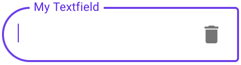
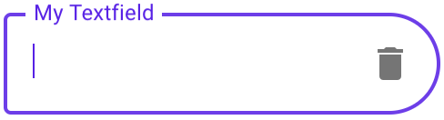
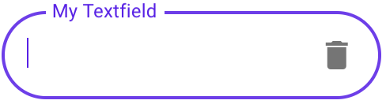

```html
<style>
  mwc-textfield.left {
    --mdc-notched-outline-leading-width: 28px;
    --mdc-notched-outline-leading-border-radius: 28px 0 0 28px;
  }

  mwc-textfield.right {
    --mdc-notched-outline-trailing-border-radius: 0 28px 28px 0;
  }
</style>

<mwc-textfield
    class="left";
    label="My Textfield"
    iconTrailing="delete"
    outlined>
</mwc-textfield>

<mwc-textfield
    class="right";
    label="My Textfield"
    iconTrailing="delete"
    outlined>
</mwc-textfield>

<mwc-textfield
    class="left right";
    label="My Textfield"
    iconTrailing="delete"
    outlined>
</mwc-textfield>

<script type="module">
  import '@material/mwc-textfield';
  import '@material/mwc-icon/mwc-icon-font.js';
</script>
```

### Fullwidth

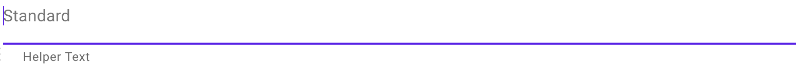

```html
<!-- Note: Fullwidth does not support label; only placeholder -->
<mwc-textfield fullwidth placeholder="My Textfield"></mwc-textfield>

<script type="module">
  import '@material/mwc-textfield';
</script>
```

## API

### Properties/Attributes

| Name                | Type                   | Description
| ------------------- | ---------------------- |------------
| `value`             | `string`               | The input control's value.
| `type`              | `HTMLInputElementType*`| A string specifying the type of control to render.
| `label`             | `string`               | Sets floating label value.
| `placeholder`       | `string`               | Sets disappearing input placeholder.
| `icon`              | `string`               | Leading icon to display in input. See [`mwc-icon`](https://github.com/material-components/material-components-web-components/tree/master/packages/icon).
| `iconTrailing`      | `string`               | Trailing icon to display in input. See [`mwc-icon`](https://github.com/material-components/material-components-web-components/tree/master/packages/icon).
| `disabled`          | `boolean`              | Whether or not the input should be disabled.
| `required`          | `boolean`              | Displays error state if value is empty and input is blurred.
| `maxlength`         | `number`               | Maximum length to accept input.
| `charCounter`       | `boolean`              | **Note: requries `maxlength` to be set.** Display character counter with max length.
| `outlined`          | `boolean`              | Whether or not to show the material outlined variant.
| `fullwidth`         | `boolean`              | Whether or not to make the input fullwidth. No longer displays `label`; only `placeholder` and `helper`.
| `helper`            | `string`               | Helper text to display below the input. Display default only when focused.
| `helperPersistent`  | `boolean`              | Always show the helper text despite focus.

\*  `HTMLInputElementType` is exported by `mwc-textfield` and `mwc-textfield-base` and `mwc-textarea`
```ts
type HTMLInputElementType =
    'hidden'|'text'|'search'|'tel'|'url'|'email'|'password'|'datetime'|'date'|
    'month'|'week'|'time'|'datetime-local'|'number'|'range'|'color'|'checkbox'|
    'radio'|'file'|'submit'|'image'|'reset'|'button';
```

### CSS Custom Properties

Inherits CSS Custom properties from:
* [`mwc-ripple`](https://github.com/material-components/material-components-web-components/tree/master/packages/ripple)
* [`mwc-notched-outline`](https://github.com/material-components/material-components-web-components/tree/master/packages/notched-outline).
* [`mwc-icon`](https://github.com/material-components/material-components-web-components/tree/master/packages/icon)

| Name                                              | Default               | Description
| ------------------------------------------------- | --------------------- |------------
| `--mdc-theme-primary`                             | `#6200ee`             | Color when active of the underline ripple, the outline, and the caret.
| `--mdc-theme-error`                               | `#b00020`             | Color when errored of the underline, the outline, the caret, and the icons.
| `--mdc-text-field-filled-border-radius`           | `4px 4px 0 0`         | Border radius of the standard / filled textfield's background filling.
| `--mdc-text-field-outlined-idle-border-color`     | `rgba(0, 0, 0, 0.38)` | Color of the outlined textfield's  outline when idle.
| `--mdc-text-field-outlined-hover-border-color`    | `rgba(0, 0, 0, 0.87)` | Color of the outlined textfield's outline when hovering.
| `--mdc-text-field-outlined-disabled-border-color` | `rgba(0, 0, 0, 0.06)` | Color of the outlined textfield's outline when disabled.

## Additional references

- [MDC Web textfields](https://material.io/develop/web/components/input-controls/text-field/)
