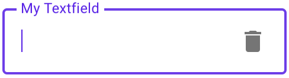

# `<mwc-textfield>` [](https://www.npmjs.com/package/@material/mwc-textfield)

> IMPORTANT: The Material Web Components are a work in progress and subject to
> major changes until 1.0 release.

Text fields let users enter and edit text.


[Material Design Guidelines: text fields](https://material.io/design/components/text-fields.html)

[Demo](https://material-components.github.io/material-components-web-components/demos/textfield/)

## Installation

```sh
npm install @material/mwc-textfield
```

> NOTE: The Material Web Components are distributed as ES2017 JavaScript
> Modules, and use the Custom Elements API. They are compatible with all modern
> browsers including Chrome, Firefox, Safari, Edge, and IE11, but an additional
> tooling step is required to resolve *bare module specifiers*, as well as
> transpilation and polyfills for IE11. See
> [here](https://github.com/material-components/material-components-web-components#quick-start)
> for detailed instructions.

## Example usage

### Standard / Filled


```html
<mwc-textfield label="My Textfield"></mwc-textfield>

<script type="module">
  import '@material/mwc-textfield';
</script>
```

### Icon - Leading


```html
<mwc-textfield label="My Textfield" icon="event"></mwc-textfield>

<script type="module">
  import '@material/mwc-textfield';
  import '@material/mwc-icon/mwc-icon-font';
</script>
```

### Icon - Trailing


```html
<mwc-textfield label="My Textfield" iconTrailing="delete"></mwc-textfield>
```

### Helper Text


```html
<mwc-textfield label="My Textfield" helper="Helper Text"></mwc-textfield>
```

### Primary Color


```html
<style>
  mwc-textfield {
    --mdc-theme-primary: green;
  }
</style>

<mwc-textfield
    label="My Textfield"
    iconTrailing="delete"
    required>
</mwc-textfield>
```

## Variants

### Outlined



```html
<mwc-textfield
    outlined
    label="My Textfield"
    iconTrailing="delete">
</mwc-textfield>
```

#### Shaping Outlined


```html
<style>
  mwc-textfield.left {
    --mdc-notched-outline-leading-width: 28px;
    --mdc-notched-outline-leading-border-radius: 28px 0 0 28px;
  }

  mwc-textfield.right {
    --mdc-notched-outline-trailing-border-radius: 0 28px 28px 0;
  }
</style>

<mwc-textfield
    class="left";
    label="My Textfield"
    iconTrailing="delete"
    outlined>
</mwc-textfield>

<mwc-textfield
    class="right";
    label="My Textfield"
    iconTrailing="delete"
    outlined>
</mwc-textfield>

<mwc-textfield
    class="left right";
    label="My Textfield"
    iconTrailing="delete"
    outlined>
</mwc-textfield>
```

## API

### Properties/Attributes

Name                      | Type                          | Description
------------------------- | ----------------------------- | -----------
`value`                   | `string`                      | The input control's value.
`type`                    | `TextFieldType*`              | A string specifying the type of control to render.
`label`                   | `string`                      | Sets floating label value.
`placeholder`             | `string`                      | Sets disappearing input placeholder.
`prefix`                  | `string`                      | Prefix text to display before the input.
`suffix`                  | `string`                      | Suffix text to display after the input.
`icon`                    | `string`                      | Leading icon to display in input. See [`mwc-icon`](https://github.com/material-components/material-components-web-components/tree/master/packages/icon).
`iconTrailing`            | `string`                      | Trailing icon to display in input. See [`mwc-icon`](https://github.com/material-components/material-components-web-components/tree/master/packages/icon).
`disabled`                | `boolean`                     | Whether or not the input should be disabled.
`charCounter`             | `boolean`                     | **Note: requries `maxLength` to be set.** Display character counter with max length.
`outlined`                | `boolean`                     | Whether or not to show the material outlined variant.
`helper`                  | `string`                      | Helper text to display below the input. Display default only when focused.
`helperPersistent`        | `boolean`                     | Always show the helper text despite focus.
`required`                | `boolean`                     | Displays error state if value is empty and input is blurred.
`maxLength`               | `number`                      | Maximum length to accept input.
`validationMessage`       | `string`                      | Message to show in the error color when the textfield is invalid. (Helper text will not be visible)
`pattern`                 | `string`                      | [`HTMLInputElement.prototype.pattern`](https://developer.mozilla.org/en-US/docs/Web/Guide/HTML/HTML5/Constraint_validation#Validation-related_attributes) (empty string will unset attribute)
`min`                     | `number`\|`string`            | [`HTMLInputElement.prototype.min`](https://developer.mozilla.org/en-US/docs/Web/Guide/HTML/HTML5/Constraint_validation#Validation-related_attributes) (empty string will unset attribute)
`max`                     | `number`\|`string`            | [`HTMLInputElement.prototype.max`](https://developer.mozilla.org/en-US/docs/Web/Guide/HTML/HTML5/Constraint_validation#Validation-related_attributes) (empty string will unset attribute)
`size`                    | `number`\|`null`              | [`HTMLInputElement.prototype.size`](https://developer.mozilla.org/en-US/docs/Web/HTML/Element/input#htmlattrdefsize) (null will unset attribute)
`step`                    | `number`\|`null`              | [`HTMLInputElement.prototype.step`](https://developer.mozilla.org/en-US/docs/Web/Guide/HTML/HTML5/Constraint_validation#Validation-related_attributes) (null will unset attribute)
`autoValidate`            | `boolean`                     | Reports validity on input rather than only on blur.
`validity`                | `ValidityState` (readonly)    | The [`ValidityState`](https://developer.mozilla.org/en-US/docs/Web/API/ValidityState) of the textfield.
`willValidate`            | `boolean` (readonly)          | [`HTMLInputElement.prototype.willValidate`](https://developer.mozilla.org/en-US/docs/Web/API/HTMLInputElement#Properties)
`validityTransform`       | `ValidityTransform**`\|`null` | Callback called before each validation check. See the [validation section](#Validation) for more details.
`validateOnInitialRender` | `boolean`                     | Runs validation check on initial render.
`name`                    | `string`                      | Sets the `name` attribute on the internal input.\*\*\*

\*  `TextFieldType` is exported by `mwc-textfield` and `mwc-textfield-base`
```ts
type TextFieldType = 'text'|'search'|'tel'|'url'|'email'|'password'|
    'date'|'month'|'week'|'time'|'datetime-local'|'number'|'color';
```

\*\* `ValidityTransform` is not exported. See the [validation section](#Validation) for more details.
```ts
type ValidityTransform = (value: string, nativeValidity: ValidityState) => Partial<ValidityState>
```

\*\*\* The `name` property should only be used for browser autofill as webcomponent form participation does not currently consider the `name` attribute. See [#289](https://github.com/material-components/material-components-web-components/issues/289).

### Methods

| Name     | Description
| -------- | -------------
| `checkValidity() => boolean`   | Returns `true` if the textfield passes validity checks. Returns `false` and fires an [`invalid`](https://developer.mozilla.org/en-US/docs/Web/API/HTMLInputElement/invalid_event) event on the textfield otherwise. <br>**NOTE:** When accessing any property or function that checks validity at textfield initial boot up, you may have to await `<mwc-textfield>.updateComplete`.
| `reportValidity() => boolean`   | Runs `checkValidity()` method, and if it returns false, then it reports to the user that the input is invalid.
| `setCustomValidity(message:string) => void`   | Sets a custom validity message (also overwrites `validationMessage`). If this message is not the empty string, then the element is suffering from a custom validity error and does not validate.
| `layout() => Promise<void>`   | Re-calculate layout. If a textfield is styled with `display:none` before it is first rendered, and it has a label that is floating, then you must call `layout()` the first time you remove `display:none`, or else the notch surrounding the label will not render correctly.

### CSS Custom Properties

Inherits CSS Custom properties from:

* [`mwc-ripple`](https://github.com/material-components/material-components-web-components/tree/master/packages/ripple)
* [`mwc-notched-outline`](https://github.com/material-components/material-components-web-components/tree/master/packages/notched-outline).
* [`mwc-icon`](https://github.com/material-components/material-components-web-components/tree/master/packages/icon)

| Name                                              | Default               | Description
| ------------------------------------------------- | --------------------- |------------
| `--mdc-theme-primary`                             | `#6200ee`             | Color when active of the underline ripple, the outline, and the caret.
| `--mdc-theme-error`                               | `#b00020`             | Color when errored of the underline, the outline, the caret, and the icons.
| `--mdc-text-field-filled-border-radius`           | `4px 4px 0 0`         | Border radius of the standard / filled textfield's background filling.
| `--mdc-text-field-idle-line-color`                | `rgba(0, 0, 0, 0.42)` | Color of the filled textfield's bottom line when idle.
| `--mdc-text-field-hover-line-color`               | `rgba(0, 0, 0, 0.87)` | Color of the filled textfield's bottom line when hovering.
| `--mdc-text-field-disabled-line-color`            | `rgba(0, 0, 0, 0.06)` | Color of the filled textfield's bottom line when disabled.
| `--mdc-text-field-outlined-idle-border-color`     | `rgba(0, 0, 0, 0.38)` | Color of the outlined textfield's  outline when idle.
| `--mdc-text-field-outlined-hover-border-color`    | `rgba(0, 0, 0, 0.87)` | Color of the outlined textfield's outline when hovering.
| `--mdc-text-field-outlined-disabled-border-color` | `rgba(0, 0, 0, 0.06)` | Color of the outlined textfield's outline when disabled.
| `--mdc-text-field-fill-color`                     | `rgb(245, 245, 245)`  | Color of the textfield's background fill (non-outlined).
| `--mdc-text-field-disabled-fill-color`            | `rgb(250, 250, 250)`  | Color of the textfield's background fill (non-outlined) when disabled.
| `--mdc-text-field-ink-color`                      | `rgba(0, 0, 0, 0.87)` | Color of the input text.
| `--mdc-text-field-label-ink-color`                | `rgba(0, 0, 0, 0.6)`  | Color of the non-focused floating label, helper text, char counter, and placeholder.
| `--mdc-text-field-disabled-ink-color`             | `rgba(0, 0, 0, 0.37)` | Color of the input text, the floating label, helper text, char counter, and placeholder of a disabled textfield.

### Validation

`<mwc-textfield>` follows the basic `<input>` [constraint validation model](https://developer.mozilla.org/en-US/docs/Web/Guide/HTML/HTML5/Constraint_validation).
It exposes:

* `required`
* `maxLength`
* `pattern`
* `min`
* `max`
* `step`
* `validity`
* `willValidate`
* `checkValidity()`
* `reportValidity()`
* `setCustomValidity(message)`

Additionally, it implements more features such as:

* `validationMessage`
* `validateOnInitialRender`
* and `validityTransform`

By default, `<mwc-textfield>` will report validation on `blur`.

#### Custom validation logic

The `validityTransform` property is a function that can be set on `<mwc-textfield>` to
implement custom validation logic that transforms the `ValidityState` of the
input control. The type of a `ValidityTransform` is the following:

```ts
(value: string, nativeValidity: ValidityState) => Partial<ValidityState>
```

Where `value` is the new value in the textfield to be validated and
`nativeValidity` is an interface of
[`ValidityState`](https://developer.mozilla.org/en-US/docs/Web/API/ValidityState)
of the native input control. For example:

```html
<mwc-textfield
    id="my-textfield"
    pattern="[0-9]+"
    value="doggos">
</mwc-textfield>
<script>
  const textfield = document.querySelector('#my-textfield');
  textfield.validityTransform = (newValue, nativeValidity) => {
    if (!nativeValidity.valid) {
      if (nativeValidity.patternMismatch) {
        const hasDog = newValue.includes('dog');
        // changes to make to the nativeValidity
        return {
          valid: hasDog,
          patternMismatch: !hasDog;
        };
      } else {
        // no changes
        return {};
      }
    } else {
      const isValid = someExpensiveOperation(newValue);
      // changes to make to the native validity
      return {
        valid: isValid,
        // or whatever type of ValidityState prop you would like to set (if any)
        customError: !isValid,
      };
    }
  }
</script>
```

In this example we first check the native validity which is invalid due to the
pattern mismatching (the value is `doggos` which is not a number). The value
includes `dog`, thus we make it valid and undo the pattern mismatch.

In this example, we also skip an expensive validity check by short-circuiting
the validation by checking the native validation.

*Note:* the UI will only update as valid / invalid by checking the `valid`
property of the transformed `ValidityState`.

## Additional references

- [MDC Web textfields](https://material.io/develop/web/components/input-controls/text-field/)
