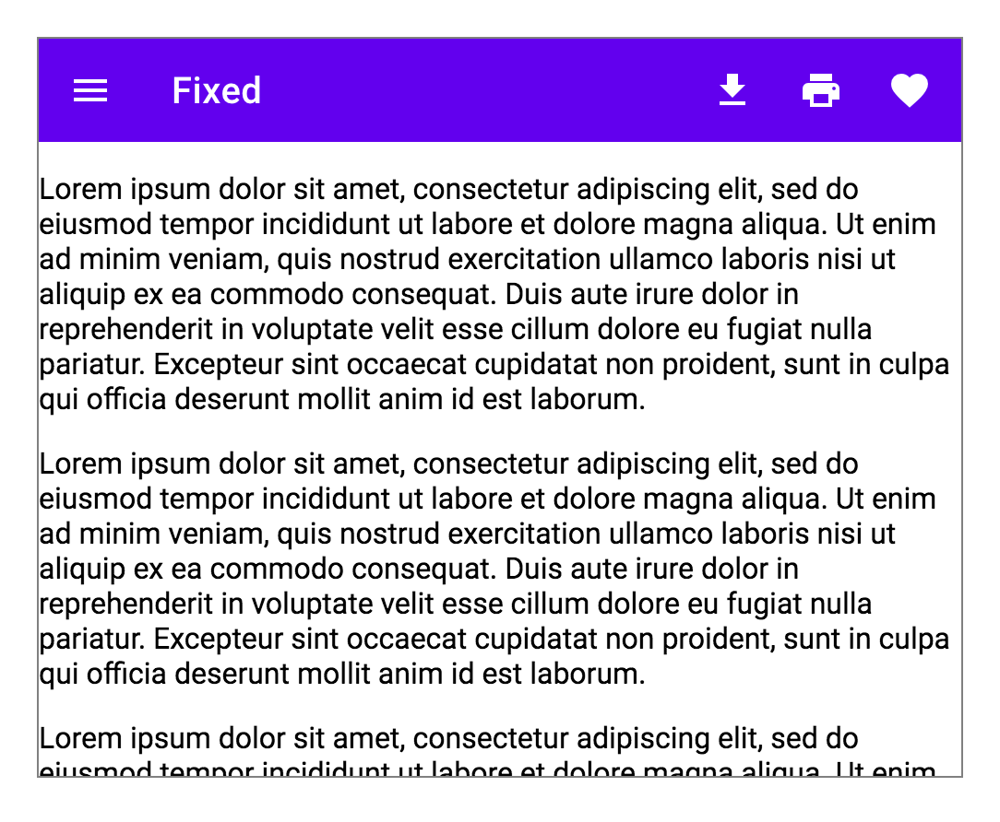
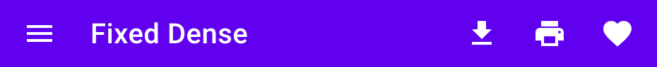
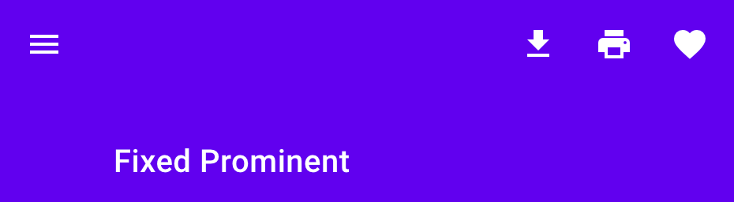
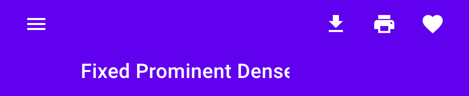
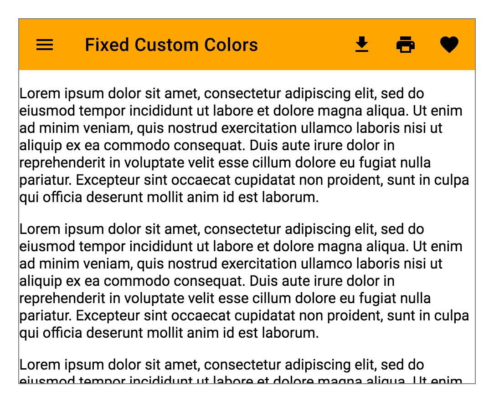

# `<mwc-top-app-bar-fixed>` [](https://www.npmjs.com/package/@material/mwc-top-app-bar-fixed)

> IMPORTANT: The Material Web Components are a work in progress and subject to
> major changes until 1.0 release.

Fixed Top App Bars are a container for items such as application title, navigation icon, and action items that are always visible.

For a version of this component that scrolls, see [`<mwc-top-app-bar>`](http://github.com/material-components/material-components-web-components/tree/master/packages/top-app-bar)

For a collapsable version of this component, see [`<mwc-top-app-bar-short>`](http://github.com/material-components/material-components-web-components/tree/master/packages/top-app-bar-short)

[Material Design Guidelines: App Bars: Top](https://material.io/design/components/app-bars-top.html)

## Installation

```sh
npm install @material/mwc-top-app-bar-fixed
```

> NOTE: The Material Web Components are distributed as ES2017 JavaScript
> Modules, and use the Custom Elements API. They are compatible with all modern
> browsers including Chrome, Firefox, Safari, Edge, and IE11, but an additional
> tooling step is required to resolve *bare module specifiers*, as well as
> transpilation and polyfills for Edge and IE11. See
> [here](https://github.com/material-components/material-components-web-components#quick-start)
> for detailed instructions.

## Example Usage

### Standard



```html
<mwc-top-app-bar-fixed>
    <mwc-icon-button icon="menu" slot="navigationIcon"></mwc-icon-button>
    <div slot="title">Title</div>
    <mwc-icon-button icon="file_download" slot="actionItems"></mwc-icon-button>
    <mwc-icon-button icon="print" slot="actionItems"></mwc-icon-button>
    <mwc-icon-button icon="favorite" slot="actionItems"></mwc-icon-button>
    <div><!-- content --></div>
</mwc-top-app-bar-fixed>
```

### Dense



```html
<mwc-top-app-bar-fixed dense>
    <mwc-icon-button icon="menu" slot="navigationIcon"></mwc-icon-button>
    <div slot="title">Title</div>
    <mwc-icon-button icon="file_download" slot="actionItems"></mwc-icon-button>
    <mwc-icon-button icon="print" slot="actionItems"></mwc-icon-button>
    <mwc-icon-button icon="favorite" slot="actionItems"></mwc-icon-button>
    <div><!-- content --></div>
</mwc-top-app-bar-fixed>
```

### Prominent



```html
<mwc-top-app-bar-fixed prominent>
    <mwc-icon-button icon="menu" slot="navigationIcon"></mwc-icon-button>
    <div slot="title">Title</div>
    <mwc-icon-button icon="file_download" slot="actionItems"></mwc-icon-button>
    <mwc-icon-button icon="print" slot="actionItems"></mwc-icon-button>
    <mwc-icon-button icon="favorite" slot="actionItems"></mwc-icon-button>
    <div><!-- content --></div>
</mwc-top-app-bar-fixed>
```

### Prominent and Dense



```html
<mwc-top-app-bar-fixed prominent dense>
    <mwc-icon-button icon="menu" slot="navigationIcon"></mwc-icon-button>
    <div slot="title">Title</div>
    <mwc-icon-button icon="file_download" slot="actionItems"></mwc-icon-button>
    <mwc-icon-button icon="print" slot="actionItems"></mwc-icon-button>
    <mwc-icon-button icon="favorite" slot="actionItems"></mwc-icon-button>
    <div><!-- content --></div>
</mwc-top-app-bar-fixed>
```

### Customize Colors



```css
mwc-top-app-bar-fixed {
  --mdc-theme-primary: orange;
  --mdc-theme-on-primary: black;
}
```

## API

### Slots
| Name | Description
| ---- | -----------
| `actionItems` | A number of `<mwc-icon-button>` elements to use for action icons on the right side.
| `navigationIcon` | `<mwc-icon-button>` elements to use for the left icon.
| `title` | A `<div>` or `<span>` that will be used as the title text.
| _default_ | Scrollable content to display under the bar. This may be the entire application.

### Properties/Attributes
| Name | Type | Default | Description
| ---- | ---- | ------- | -----------
| `dense` | `boolean` | `false` | Makes the bar a little smaller for higher density applications.
| `prominent` | `boolean` | `false` | Makes the bar much taller, can be combined with `dense`.
| `scrollTarget` | `HTMLElement` \| `Window` | `window` | Element used to listen for `scroll` events.

### Methods
*None*

### Events

| Name | Detail | Description
| ---- | ------ | -----------
| `MDCTopAppBar:nav` | `{}` | Fired when the `navigationIcon` is clicked.

### CSS Custom Properties

| Name | Default | Description
| ---- | ------- | -----------
| `--mdc-theme-primary` |  `#6200ee` | Background color of the bar
| `--mdc-theme-on-primary` |  `#ffffff` | Text color of the title, and icon colors

## Additional references

- [MDC Web: Top App Bar](https://material.io/develop/web/components/top-app-bar/)